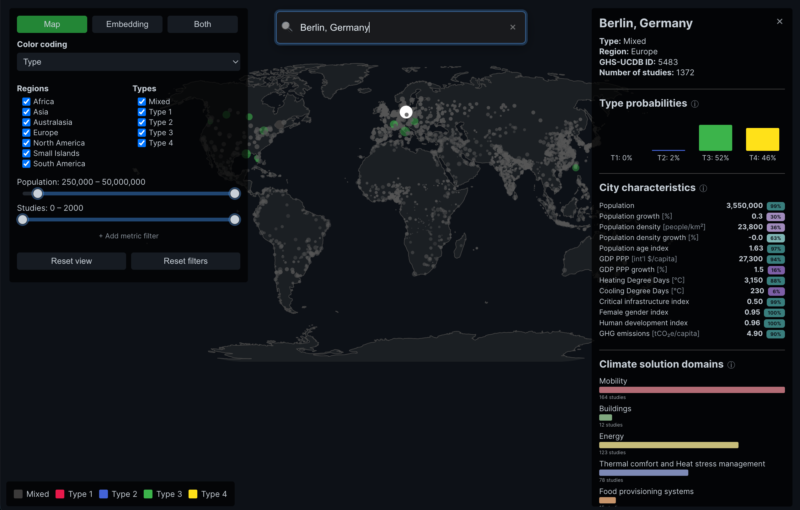

# Cities Learning Explorer

A public-facing explorer for a data-driven typology of ~11k global cities.



The landing page introduces the four city archetypes and why they matter; the explorer lets you search, filter, and compare cities on a map or in an embedding view to spot peers, gaps, and learning opportunities.

## Citation

> Montfort, S., Nachtigall, F., Repke, T., Binder, C. R., & Creutzig, F.
A global typology of cities supporting coordinated climate action.
Manuscript under review.


## Architecture & tech stack
Single-page app built with Vite + React (React 19). Landing map uses MapLibre GL; explorer uses Plotly for both the map and embedding visualizations. Everything is rendered from the static `public/cities.json`, and the production image serves the bundle via Nginx with Traefik-ready docker compose config.

## Development

### Run locally
```bash
npm install          # Node 20+ recommended
npm run dev          # start Vite dev server
```
Open the printed localhost URL. Edit or replace `public/cities.json` to change the dataset.

### Build & preview
```bash
npm run build        # outputs to dist/
npm run preview      # serve the production build locally
```

### Dockerized
- Local: `docker compose -f docker-compose-local.yml up --build -d` then visit `http://localhost:8080`.
- Production: `docker compose up --build -d` then visit `https://cities-explorer.eubucco.com/`. Compose config contains labels for Traefik routing. Traefik is deployed separately.

### Notes
- Linting: `npm run lint`.
- If the map on the landing page does not render, ensure WebGL is available/enabled in your browser.
